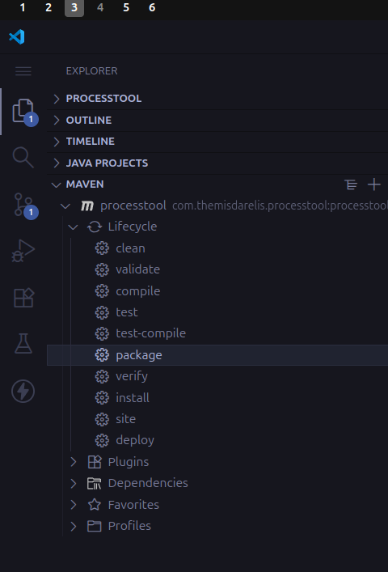
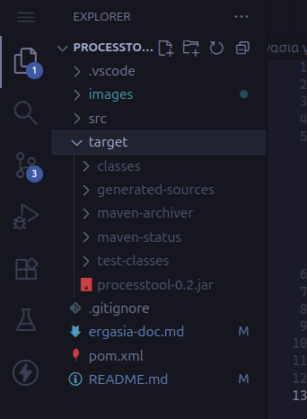

# Εργασια για το μαθημα Θέματα επιστημης υπολογιστών

## Για να το τρεξω:

Το [JDK version 25](https://www.oracle.com/java/technologies/downloads/) πρεπει να ειναι εγκαταστημένο στον υπολογιστη. Εαν θελετε να κανετε compile τον κώδικα θα χρειαστειτε το [Maven](https://maven.apache.org/download.cgi). Στο Ubuntu υπαρχει πακέτο. Σε περίτωση που χρησιμοποιειτε το VScode, το Maven extension μπορει να σας κάνει την ζωή πιο ευκολη.



Εαν θελετε να το κανετε μεσω κονσολας και οχι απο το VSCode:

1. Για "ξερω"compile:

```bash
mvn compile
```

2. Για package:

```bash
mvn clean package
```

Αυτο θα δημιουργισει ενα .jar στο /target


Για να το τρεξετε:

```bash
java -jar target/processtool-0.2.jar
```

**Προσοχη** στο "-0.2" η εκδοση μπορει να αλλαξει.
